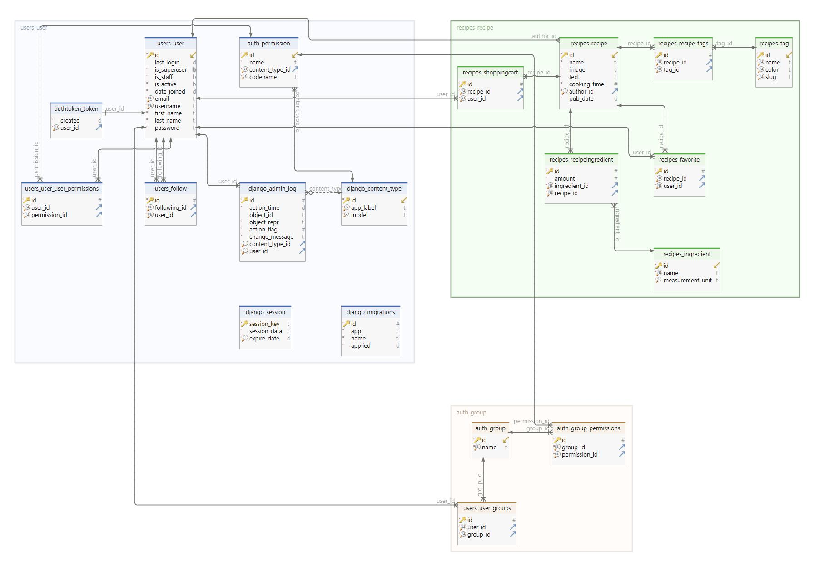

## Развёртывание проекта локально:
+ Клонировать репозиторий и перейти в него в командной строке:
```shell script
git clone git@github.com:Furturnax/foodgram-project-react.git
```

```shell script
cd foodgram-project-react/
```

+ Cоздать и активировать виртуальное окружение `(Windows/Bash)`:
```shell script
cd backend/
```

```shell script
python -m venv venv
```

```shell script
source venv/Scripts/activate
```

+ Установить зависимости из файла `requirements.txt`:
```shell script
python -m pip install --upgrade pip
```

```shell script
pip install -r requirements.txt
```

+ Установить [Docker compose](https://www.docker.com/) на свой компьютер.

+ Создать файл `.env` с переменными окружения в `dev`:

[Примеры переменных окружения](./dev/.env.example)

+ Внести изменения в проекте:
```shell script
# Foodgram/settings.py
dotenv_path='../dev/.env'
ALLOWED_HOSTS = ['*']

# Foodgram/urls.py
path('', include('api.urls')),
```

+ Запустить проект через `docker-compose`:
```shell script
cd foodgram-project-react/dev
```

```shell script
docker compose -f docker-compose.production.yml up --build -d
```

+ Собрать статику:
```shell script
docker compose -f docker-compose.production.yml exec backend python manage.py collectstatic
```

```shell script
docker compose -f docker-compose.production.yml exec backend cp -r /app/collected_static/. /app/static/
```
+ Запустить backend сервер:
```shell script
cd backend/
```
```shell script
python manage.py migrate
```
```shell script
python manage.py runserver
```
В `docker` за счет демона контейнеры крутятся, севрер локально запущен. Можно вести разработку.

<br>

## Схема базы данных:

